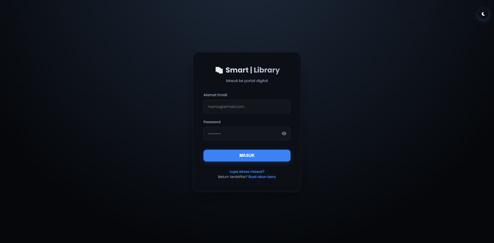
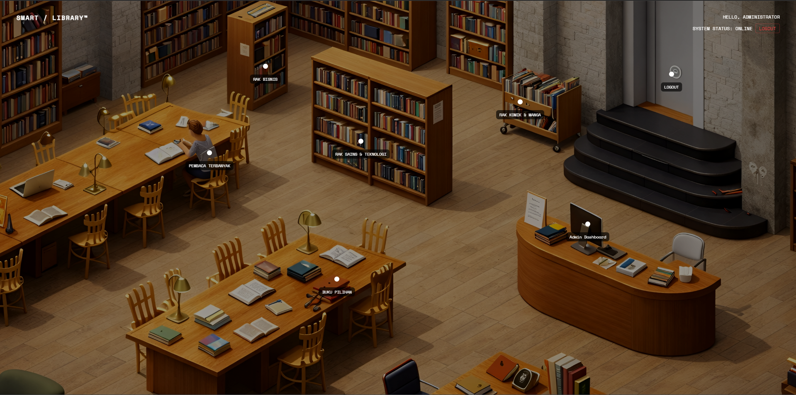
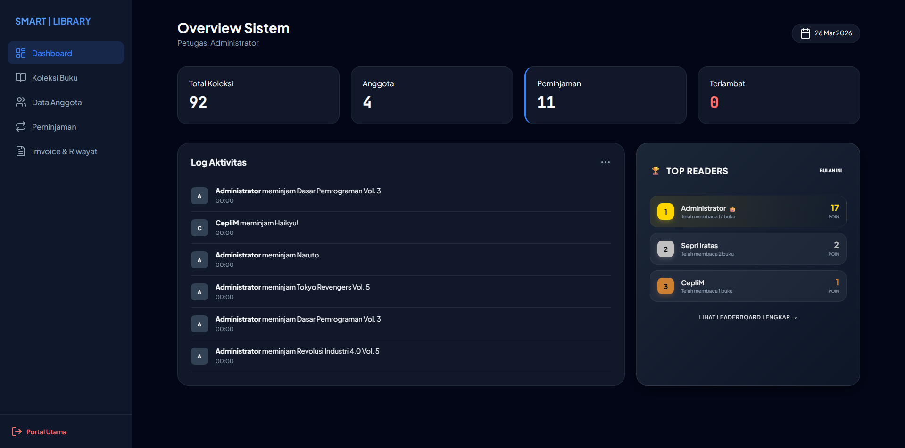
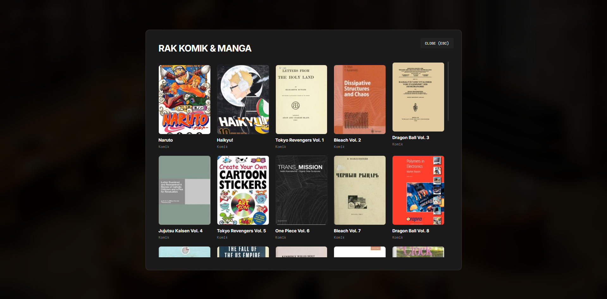

# Smart | Library - Digital Portal Experience 📚✨

Smart | Library adalah sistem manajemen perpustakaan digital modern yang menggabungkan fungsionalitas admin dashboard dengan pengalaman visual interaktif menggunakan tampilan **Isometric Room**.

## 🚀 Fitur Utama

* **Interactive Isometric Room**: Navigasi perpustakaan melalui ruangan 3D visual di mana pengguna bisa memilih rak buku secara langsung.
* **Modern Admin Dashboard**: Monitoring total koleksi, jumlah anggota, dan status peminjaman secara real-time.
* **Log Aktivitas & Leaderboard**: Menampilkan riwayat peminjaman terbaru dan daftar "Top Readers".
* **Manajemen Buku & Komik**: Katalog yang rapi dengan tampilan grid card yang responsif.
* **Dark Mode UI**: Antarmuka yang elegan dan nyaman di mata.

## 📸 Screenshots

### 1. Login Page

*Halaman masuk dengan autentikasi yang aman dan desain clean.*

### 2. Interactive Isometric Room

*Portal utama interaktif untuk menjelajahi berbagai kategori rak buku.*

### 3. Admin Dashboard Overview

*Panel kontrol utama untuk memantau statistik perpustakaan dan aktivitas anggota.*

### 4. Rak Komik & Manga

*Koleksi buku dan manga yang ditampilkan secara visual.*

## 🛠️ Teknologi yang Digunakan

* **Frontend**: Tailwind CSS, JavaScript (Interaktifitas Room)
* **Backend**: PHP + API
* **Database**: MySQL
* **Styling**: Custom Dark Theme

## ⚙️ Cara Instalasi Lokal

1. Clone repository ini:
   ```bash
   git clone [https://github.com/Ceplin03/Perpustakaan-Digital-Berbasis-Isometric.git](https://github.com/Ceplin03/Perpustakaan-Digital-Berbasis-Isometric.git)
